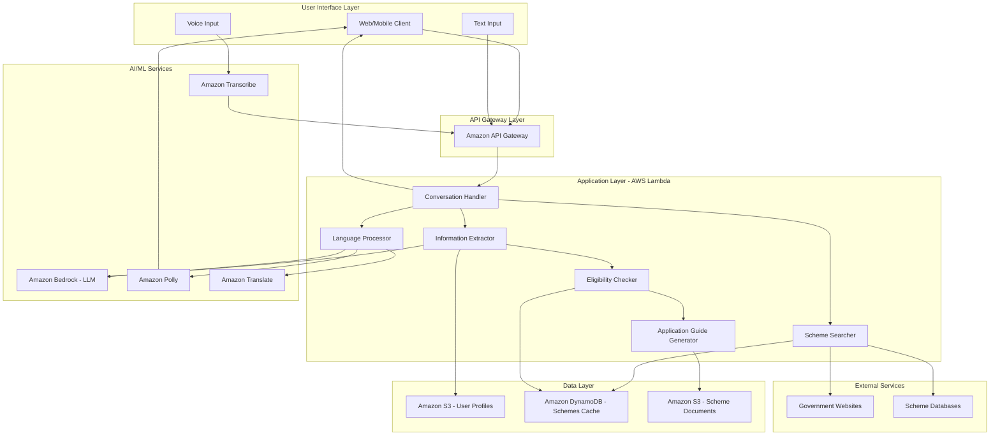
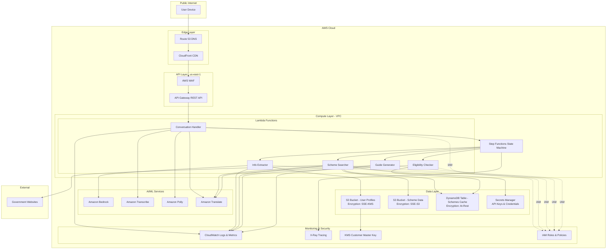
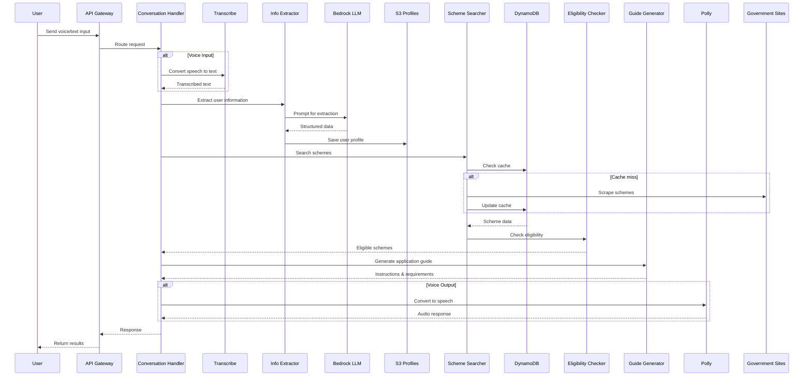

# Design Document: Government Schemes AI Assistant

## Overview

The Government Schemes AI Assistant is a cloud-based, serverless application built on AWS that helps Indian citizens discover and apply for government schemes. The system uses natural language processing (NLP) and large language models (LLMs) to extract information from user conversations, search government websites for schemes, determine eligibility, and provide application guidance in multiple languages.

### Design Principles

1. **Serverless Architecture**: Use AWS Lambda and managed services for scalability and cost-efficiency
2. **Multilingual First**: Support for major Indian languages throughout the system
3. **Privacy by Design**: Encrypt sensitive user data and minimize data retention
4. **Resilient**: Graceful degradation when external services are unavailable
5. **Accessible**: Support both text and voice interactions for inclusivity

### Technology Stack

- **Compute**: AWS Lambda (Python runtime)
- **LLM**: Amazon Bedrock (Claude or Llama models) for conversation and extraction
- **Speech**: Amazon Transcribe (speech-to-text), Amazon Polly (text-to-speech)
- **Translation**: Amazon Translate for multilingual support
- **Storage**: Amazon S3 (user profiles, scheme data), Amazon DynamoDB (metadata, cache)
- **Search**: AWS Lambda with BeautifulSoup/Scrapy for web scraping
- **API**: Amazon API Gateway (REST API)
- **Orchestration**: AWS Step Functions for multi-step workflows
- **Monitoring**: Amazon CloudWatch for logging and metrics

## Architecture

### High-Level Architecture



### AWS Infrastructure Architecture



### Data Flow Architecture



## Components and Interfaces

### 1. Conversation Handler

**Responsibility**: Orchestrates the entire user interaction flow

**Interface**:
```python
class ConversationHandler:
    def handle_request(
        self,
        input_text: Optional[str],
        audio_data: Optional[bytes],
        language_code: str,
        user_id: str,
        session_id: str
    ) -> ConversationResponse:
        """
        Main entry point for user requests
        
        Args:
            input_text: Text input from user (if text mode)
            audio_data: Audio bytes from user (if voice mode)
            language_code: User's preferred language (e.g., 'hi-IN', 'en-IN')
            user_id: Unique user identifier
            session_id: Conversation session identifier
            
        Returns:
            ConversationResponse with text/audio output and eligible schemes
        """
        pass
```

**Dependencies**: Transcribe, Info Extractor, Scheme Searcher, Eligibility Checker, Guide Generator, Polly

### 2. Information Extractor

**Responsibility**: Extracts structured personal information from natural language

**Interface**:
```python
class InformationExtractor:
    def extract_user_info(
        self,
        conversation_text: str,
        existing_profile: Optional[UserProfile]
    ) -> ExtractionResult:
        """
        Extract personal information from conversation
        
        Args:
            conversation_text: User's input text
            existing_profile: Previously extracted information (if any)
            
        Returns:
            ExtractionResult with extracted fields and confidence scores
        """
        pass
    
    def identify_missing_fields(
        self,
        profile: UserProfile
    ) -> List[str]:
        """
        Identify which required fields are missing
        
        Args:
            profile: Current user profile
            
        Returns:
            List of missing field names
        """
        pass
```

**Data Model**:
```python
@dataclass
class UserProfile:
    user_id: str
    name: Optional[str]
    age: Optional[int]
    date_of_birth: Optional[date]
    gender: Optional[str]
    annual_income: Optional[float]
    caste_category: Optional[str]  # General, OBC, SC, ST
    state: Optional[str]
    district: Optional[str]
    education_level: Optional[str]
    occupation: Optional[str]
    is_student: bool
    student_class: Optional[int]  # If student
    interests: List[str]  # For students: engineering, medical, etc.
    disability_status: Optional[str]
    family_size: Optional[int]
    created_at: datetime
    updated_at: datetime
```

### 3. Scheme Searcher

**Responsibility**: Searches and retrieves government schemes from multiple sources

**Interface**:
```python
class SchemeSearcher:
    def search_schemes(
        self,
        user_profile: UserProfile,
        scheme_types: Optional[List[str]] = None
    ) -> List[GovernmentScheme]:
        """
        Search for government schemes
        
        Args:
            user_profile: User's personal information
            scheme_types: Filter by scheme types (education, health, etc.)
            
        Returns:
            List of all available schemes (not filtered by eligibility)
        """
        pass
    
    def scrape_government_portal(
        self,
        portal_url: str
    ) -> List[GovernmentScheme]:
        """
        Scrape schemes from a government website
        
        Args:
            portal_url: URL of government portal
            
        Returns:
            List of schemes found on the portal
        """
        pass
```

**Data Model**:
```python
@dataclass
class GovernmentScheme:
    scheme_id: str
    name: str
    description: str
    scheme_type: str  # education, health, housing, employment, etc.
    benefits: str
    eligibility_criteria: Dict[str, Any]
    required_documents: List[str]
    application_process: str
    application_url: Optional[str]
    deadline: Optional[date]
    state: Optional[str]  # None for central schemes
    source_url: str
    last_updated: datetime
```

### 4. Eligibility Checker

**Responsibility**: Determines which schemes a user qualifies for

**Interface**:
```python
class EligibilityChecker:
    def check_eligibility(
        self,
        user_profile: UserProfile,
        schemes: List[GovernmentScheme]
    ) -> List[EligibilityResult]:
        """
        Check user eligibility for schemes
        
        Args:
            user_profile: User's personal information
            schemes: List of schemes to check
            
        Returns:
            List of eligibility results with match scores
        """
        pass
    
    def explain_eligibility(
        self,
        user_profile: UserProfile,
        scheme: GovernmentScheme,
        is_eligible: bool
    ) -> str:
        """
        Generate human-readable eligibility explanation
        
        Args:
            user_profile: User's information
            scheme: The scheme being checked
            is_eligible: Whether user is eligible
            
        Returns:
            Explanation text
        """
        pass
```

**Data Model**:
```python
@dataclass
class EligibilityResult:
    scheme: GovernmentScheme
    is_eligible: bool
    match_score: float  # 0.0 to 1.0
    matched_criteria: List[str]
    unmatched_criteria: List[str]
    explanation: str
```

### 5. Application Guide Generator

**Responsibility**: Generates step-by-step application instructions and document checklists

**Interface**:
```python
class ApplicationGuideGenerator:
    def generate_application_guide(
        self,
        scheme: GovernmentScheme,
        user_profile: UserProfile,
        language_code: str
    ) -> ApplicationGuide:
        """
        Generate application instructions for a scheme
        
        Args:
            scheme: The government scheme
            user_profile: User's information
            language_code: Output language
            
        Returns:
            Complete application guide
        """
        pass
    
    def generate_document_checklist(
        self,
        scheme: GovernmentScheme,
        user_profile: UserProfile
    ) -> DocumentChecklist:
        """
        Generate personalized document checklist
        
        Args:
            scheme: The government scheme
            user_profile: User's information
            
        Returns:
            Checklist with document status
        """
        pass
```

**Data Model**:
```python
@dataclass
class ApplicationGuide:
    scheme_name: str
    steps: List[ApplicationStep]
    document_checklist: DocumentChecklist
    important_dates: List[ImportantDate]
    contact_information: ContactInfo
    tips: List[str]

@dataclass
class DocumentChecklist:
    required_documents: List[Document]
    optional_documents: List[Document]
    
@dataclass
class Document:
    name: str
    description: str
    format_requirements: str
    likely_has: bool  # Based on user profile
    how_to_obtain: Optional[str]
```

### 6. Language Processor

**Responsibility**: Handles multilingual translation and speech conversion

**Interface**:
```python
class LanguageProcessor:
    def detect_language(
        self,
        text: str
    ) -> str:
        """
        Detect language of input text
        
        Args:
            text: Input text
            
        Returns:
            Language code (e.g., 'hi', 'en', 'ta')
        """
        pass
    
    def translate_text(
        self,
        text: str,
        source_lang: str,
        target_lang: str
    ) -> str:
        """
        Translate text between languages
        
        Args:
            text: Text to translate
            source_lang: Source language code
            target_lang: Target language code
            
        Returns:
            Translated text
        """
        pass
    
    def text_to_speech(
        self,
        text: str,
        language_code: str,
        voice_id: str
    ) -> bytes:
        """
        Convert text to speech audio
        
        Args:
            text: Text to convert
            language_code: Language of text
            voice_id: Voice identifier for Polly
            
        Returns:
            Audio bytes (MP3 format)
        """
        pass
```

### 7. Exam Recommender (Student-Specific)

**Responsibility**: Recommends competitive exams and scholarships for students

**Interface**:
```python
class ExamRecommender:
    def recommend_exams(
        self,
        user_profile: UserProfile
    ) -> List[CompetitiveExam]:
        """
        Recommend competitive exams for student
        
        Args:
            user_profile: Student's profile
            
        Returns:
            List of relevant exams
        """
        pass
    
    def get_exam_details(
        self,
        exam_id: str
    ) -> ExamDetails:
        """
        Get detailed information about an exam
        
        Args:
            exam_id: Exam identifier
            
        Returns:
            Complete exam details
        """
        pass
```

**Data Model**:
```python
@dataclass
class CompetitiveExam:
    exam_id: str
    name: str
    full_name: str
    exam_type: str  # engineering, medical, defense, school_admission
    conducting_body: str
    eligibility_criteria: Dict[str, Any]
    registration_start: date
    registration_end: date
    exam_date: date
    syllabus_url: str
    official_website: str
    application_fee: float
    preparation_resources: List[str]
```

## Data Models

### Storage Strategy

**Amazon S3 - User Profiles**:
- Bucket: `govt-schemes-user-profiles-{env}`
- Structure: `{user_id}/profile.json`
- Encryption: SSE-KMS with customer-managed key
- Lifecycle: Transition to Glacier after 90 days of inactivity
- Versioning: Enabled

**Amazon DynamoDB - Schemes Cache**:
- Table: `govt-schemes-cache`
- Partition Key: `scheme_id` (String)
- Sort Key: `state` (String, "CENTRAL" for central schemes)
- TTL: 7 days (schemes are refreshed weekly)
- GSI: `scheme_type-index` for filtering by type

**Amazon S3 - Scheme Documents**:
- Bucket: `govt-schemes-documents-{env}`
- Structure: `schemes/{scheme_id}/documents/`
- Encryption: SSE-S3
- Public read access with CloudFront

### Database Schema

**DynamoDB Table: govt-schemes-cache**
```json
{
  "scheme_id": "PM-SCHOLARSHIP-2024",
  "state": "CENTRAL",
  "name": "Prime Minister's Scholarship Scheme",
  "description": "...",
  "scheme_type": "education",
  "eligibility_criteria": {
    "min_age": 18,
    "max_age": 25,
    "max_income": 600000,
    "education_level": ["12th", "undergraduate"],
    "categories": ["General", "OBC", "SC", "ST"]
  },
  "benefits": "₹2,500 per month for 10 months",
  "required_documents": ["Aadhar", "Income Certificate", "Marksheet"],
  "application_url": "https://...",
  "deadline": "2024-12-31",
  "source_url": "https://...",
  "last_updated": "2024-01-15T10:30:00Z",
  "ttl": 1705334400
}
```

**S3 Object: User Profile**
```json
{
  "user_id": "user_123456",
  "name": "Rajesh Kumar",
  "age": 17,
  "date_of_birth": "2007-03-15",
  "gender": "male",
  "annual_income": 300000,
  "caste_category": "OBC",
  "state": "Uttar Pradesh",
  "district": "Lucknow",
  "education_level": "12th",
  "occupation": "student",
  "is_student": true,
  "student_class": 12,
  "interests": ["engineering", "technology"],
  "disability_status": null,
  "family_size": 4,
  "created_at": "2024-01-15T10:00:00Z",
  "updated_at": "2024-01-15T10:00:00Z"
}
```


## Correctness Properties

*A property is a characteristic or behavior that should hold true across all valid executions of a system—essentially, a formal statement about what the system should do. Properties serve as the bridge between human-readable specifications and machine-verifiable correctness guarantees.*

### Information Extraction Properties

**Property 1: Extraction Completeness**
*For any* user conversation containing personal information, the Information Extractor should extract all present fields (name, age, income, caste, etc.) with non-null values in the resulting UserProfile.
**Validates: Requirements 1.4, 2.2**

**Property 2: Missing Field Detection**
*For any* UserProfile with incomplete mandatory fields, the system should identify and return the exact set of missing field names.
**Validates: Requirements 1.5, 2.3**

**Property 3: Language Detection Accuracy**
*For any* text input in a supported language, the Language Processor should correctly identify the language code matching the input language.
**Validates: Requirements 1.3**

**Property 4: Profile Update Idempotence**
*For any* existing UserProfile and new information, updating the profile twice with the same information should produce the same result as updating once.
**Validates: Requirements 2.5**

### Data Persistence Properties

**Property 5: Profile Storage Round-Trip**
*For any* valid UserProfile, saving it to S3 and then retrieving it should produce an equivalent UserProfile with all fields preserved.
**Validates: Requirements 2.1, 2.4**

**Property 6: Profile Deletion Completeness**
*For any* UserProfile that exists in the system, after deletion, no queries should return any data associated with that user_id.
**Validates: Requirements 9.5**

### Scheme Discovery Properties

**Property 7: Scheme Data Completeness**
*For any* GovernmentScheme retrieved by the Scheme Searcher, it should contain all mandatory fields: scheme_id, name, eligibility_criteria, benefits, and required_documents.
**Validates: Requirements 3.2**

**Property 8: Structured Extraction from HTML**
*For any* valid HTML content from a government website containing scheme information, the Scheme Searcher should extract a valid GovernmentScheme object without throwing exceptions.
**Validates: Requirements 3.4**

### Eligibility Checking Properties

**Property 9: Eligibility Filter Correctness**
*For any* UserProfile and list of GovernmentSchemes, all schemes returned by the Eligibility Checker should have eligibility criteria that are satisfied by the UserProfile.
**Validates: Requirements 4.2**

**Property 10: Eligibility Explanation Presence**
*For any* scheme marked as eligible for a user, the Eligibility Checker should generate a non-empty explanation string describing why the user qualifies.
**Validates: Requirements 4.4**

**Property 11: Scheme Ranking Consistency**
*For any* set of eligible schemes, the ranking order should be deterministic—running the ranking algorithm twice on the same input should produce the same order.
**Validates: Requirements 4.3**

**Property 12: Near-Miss Gap Identification**
*For any* UserProfile and GovernmentScheme where the user fails exactly one eligibility criterion, the system should identify and return that specific criterion as the gap.
**Validates: Requirements 4.5**

### Presentation Properties

**Property 13: Presentation Field Completeness**
*For any* GovernmentScheme being presented to a user, the output should include the scheme name, benefits, eligibility criteria, and application deadline (if available).
**Validates: Requirements 5.2**

**Property 14: Language Consistency Throughout Session**
*For any* user session with a specified input language, all outputs (scheme presentations, application guides, document checklists, error messages) should be in that same language.
**Validates: Requirements 5.3, 6.5, 7.5, 8.3, 11.4**

### Application Guidance Properties

**Property 15: Application Guide Completeness**
*For any* GovernmentScheme, the generated ApplicationGuide should include non-empty values for: steps, document_checklist, and contact_information.
**Validates: Requirements 6.1, 6.2, 6.4, 7.1**

**Property 16: Document Personalization Accuracy**
*For any* UserProfile and DocumentChecklist, documents that can be inferred from the profile (e.g., Aadhar for any Indian citizen, student ID for students) should be marked with likely_has=true.
**Validates: Requirements 7.2**

**Property 17: Document Format Specification**
*For any* Document in a DocumentChecklist, the format_requirements field should be non-empty and specify the required format.
**Validates: Requirements 7.4**

### Multilingual Properties

**Property 18: Translation Preservation**
*For any* text containing technical terms (e.g., "Aadhar", "JEE", "NEET") and proper nouns, translating to another language and back should preserve these terms unchanged.
**Validates: Requirements 8.4**

**Property 19: Text-to-Speech Generation**
*For any* non-empty text string and valid language code, the Language Processor should generate audio bytes without throwing exceptions.
**Validates: Requirements 8.2**

**Property 20: Speech-to-Text Conversion**
*For any* valid audio bytes in a supported language, Amazon Transcribe should return a non-empty text string.
**Validates: Requirements 1.2**

### Student-Specific Properties

**Property 21: Student Exam Relevance**
*For any* UserProfile where is_student=true, all recommended CompetitiveExams should have eligibility criteria that match the student's class/grade level.
**Validates: Requirements 10.1**

**Property 22: Exam Information Completeness**
*For any* CompetitiveExam presented to a student, it should include registration_start, registration_end, exam_date, eligibility_criteria, and official_website.
**Validates: Requirements 10.3**

**Property 23: Scholarship Filtering Accuracy**
*For any* student UserProfile, all returned scholarships should match at least one of: academic level, income bracket, or caste category from the profile.
**Validates: Requirements 10.4**

**Property 24: Exam Prioritization by Interest**
*For any* student UserProfile with specified interests and multiple matching exams, exams matching the student's interests should be ranked higher than those that don't.
**Validates: Requirements 10.6**

**Property 25: Deadline Alert Generation**
*For any* CompetitiveExam with a registration_end date within 30 days of the current date, an alert should be included in the response to the student.
**Validates: Requirements 10.7**

### Error Handling Properties

**Property 26: Graceful Website Failure**
*For any* list of government website URLs where at least one is unavailable (returns 404, 500, or timeout), the Scheme Searcher should still return schemes from available sources without throwing exceptions.
**Validates: Requirements 3.3, 11.1**

**Property 27: Low-Confidence Clarification**
*For any* information extraction result where the confidence score is below 0.7, the system should generate a clarification question rather than storing the uncertain value.
**Validates: Requirements 11.3**

## Error Handling

### Error Categories

1. **External Service Failures**
   - AWS service unavailability (Bedrock, Transcribe, Polly, Translate)
   - Government website unavailability or timeout
   - Network connectivity issues

2. **Data Quality Issues**
   - Malformed user input
   - Incomplete or ambiguous information
   - Invalid audio format for speech input

3. **Business Logic Errors**
   - No schemes found for user profile
   - User ineligible for all schemes
   - Missing required documents for scheme application

4. **System Errors**
   - S3 storage failures
   - DynamoDB read/write failures
   - Lambda timeout or memory limits

### Error Handling Strategies

**Retry with Exponential Backoff**:
- Applied to: AWS service calls, government website scraping
- Configuration: 3 retries, initial delay 100ms, backoff factor 2
- Implementation: Use AWS SDK built-in retry logic

**Circuit Breaker Pattern**:
- Applied to: Government website scraping
- Configuration: Open circuit after 5 consecutive failures, half-open after 60 seconds
- Purpose: Prevent cascading failures when websites are down

**Graceful Degradation**:
- If Bedrock is unavailable: Fall back to rule-based extraction
- If Translate is unavailable: Return response in English with apology message
- If Polly is unavailable: Return text-only response
- If one government portal fails: Continue with other portals

**User-Friendly Error Messages**:
```python
ERROR_MESSAGES = {
    "en": {
        "service_unavailable": "We're experiencing technical difficulties. Please try again in a few minutes.",
        "no_schemes_found": "We couldn't find any schemes matching your profile. Try updating your information.",
        "speech_recognition_failed": "We couldn't understand the audio. Please try speaking again or use text input.",
    },
    "hi": {
        "service_unavailable": "हमें तकनीकी समस्या हो रही है। कृपया कुछ मिनटों में पुनः प्रयास करें।",
        "no_schemes_found": "हमें आपकी प्रोफ़ाइल से मेल खाने वाली कोई योजना नहीं मिली। अपनी जानकारी अपडेट करने का प्रयास करें।",
        "speech_recognition_failed": "हम ऑडियो को नहीं समझ सके। कृपया फिर से बोलने का प्रयास करें या टेक्स्ट इनपुट का उपयोग करें।",
    }
}
```

**Logging and Monitoring**:
- All errors logged to CloudWatch with structured logging
- Error metrics tracked: error rate, error type distribution, affected users
- Alarms configured for: error rate > 5%, service unavailability, Lambda failures
- X-Ray tracing enabled for distributed tracing across services

### Validation Rules

**Input Validation**:
- Age: 0-120 years
- Income: 0-100,000,000 INR
- Language code: Must be in supported languages list
- Audio format: MP3, WAV, or OGG, max 10MB
- Text input: Max 5000 characters per message

**Data Validation**:
- UserProfile: All mandatory fields present before saving
- GovernmentScheme: Valid scheme_id format, non-empty name and eligibility_criteria
- Date fields: Must be valid dates, deadlines must be in the future

## Testing Strategy

### Dual Testing Approach

The system will be validated using both unit tests and property-based tests, which are complementary and together provide comprehensive coverage.

**Unit Tests**: Focus on specific examples, edge cases, and error conditions
- Specific user profiles with known eligibility outcomes
- Edge cases like boundary ages, income thresholds
- Error conditions like malformed input, service failures
- Integration points between components

**Property-Based Tests**: Verify universal properties across all inputs
- Generate random user profiles and verify extraction
- Generate random scheme data and verify eligibility checking
- Test language consistency across random language codes
- Verify data persistence with random profile data

### Property-Based Testing Configuration

**Framework**: Hypothesis (Python)
- Minimum 100 iterations per property test
- Each test tagged with: **Feature: govt-schemes-ai-assistant, Property {number}: {property_text}**
- Seed-based reproducibility for failed tests

**Test Data Generators**:
```python
@composite
def user_profile_strategy(draw):
    """Generate random but valid UserProfile instances"""
    return UserProfile(
        user_id=draw(st.uuids()).hex,
        name=draw(st.text(min_size=1, max_size=100)),
        age=draw(st.integers(min_value=0, max_value=120)),
        annual_income=draw(st.floats(min_value=0, max_value=100000000)),
        caste_category=draw(st.sampled_from(["General", "OBC", "SC", "ST"])),
        state=draw(st.sampled_from(INDIAN_STATES)),
        is_student=draw(st.booleans()),
        # ... other fields
    )

@composite
def government_scheme_strategy(draw):
    """Generate random but valid GovernmentScheme instances"""
    return GovernmentScheme(
        scheme_id=draw(st.text(min_size=1, max_size=50)),
        name=draw(st.text(min_size=1, max_size=200)),
        eligibility_criteria=draw(st.dictionaries(
            keys=st.sampled_from(["min_age", "max_age", "max_income"]),
            values=st.integers(min_value=0, max_value=1000000)
        )),
        # ... other fields
    )
```

### Unit Test Coverage

**Target Coverage**: 80% code coverage minimum

**Critical Test Cases**:
1. Information extraction with various conversation formats
2. Eligibility checking with boundary conditions (age=18, income=threshold)
3. Language detection for all supported languages
4. Error handling for each error category
5. Profile CRUD operations (Create, Read, Update, Delete)
6. Scheme search with cache hit/miss scenarios
7. Student exam recommendations for different grade levels
8. Multilingual translation accuracy for key terms

### Integration Testing

**AWS Service Integration**:
- Mock AWS services using moto library for unit tests
- Use actual AWS services in integration tests (separate AWS account)
- Test Lambda function integration with Step Functions
- Test API Gateway integration with Lambda

**End-to-End Testing**:
- Simulate complete user journeys from input to scheme recommendations
- Test voice input → transcription → extraction → eligibility → voice output flow
- Test multilingual flows in Hindi, Tamil, and English
- Test student-specific flows with exam recommendations

### Performance Testing

**Load Testing**:
- Target: 100 concurrent users
- Tool: Locust or Artillery
- Metrics: Response time (p95 < 3s), error rate (< 1%)

**Scalability Testing**:
- Test Lambda auto-scaling under load
- Test DynamoDB throughput with burst traffic
- Test S3 read/write performance with concurrent requests

### Security Testing

**Penetration Testing**:
- SQL injection attempts (though using NoSQL)
- XSS attempts in user input
- Authentication bypass attempts
- Data exposure through API

**Compliance Testing**:
- Verify encryption at rest (S3, DynamoDB)
- Verify encryption in transit (TLS 1.2+)
- Verify data deletion completeness
- Verify access logging enabled

## Deployment Strategy

### Infrastructure as Code

**Tool**: AWS CDK (Python)

**Stack Structure**:
```
govt-schemes-ai-assistant/
├── stacks/
│   ├── api_stack.py          # API Gateway, Lambda functions
│   ├── data_stack.py          # S3, DynamoDB, KMS
│   ├── ai_stack.py            # Bedrock, Transcribe, Polly, Translate
│   ├── monitoring_stack.py    # CloudWatch, X-Ray, alarms
│   └── network_stack.py       # VPC, security groups (if needed)
├── lambda/
│   ├── conversation_handler/
│   ├── info_extractor/
│   ├── scheme_searcher/
│   ├── eligibility_checker/
│   └── guide_generator/
└── app.py                     # CDK app entry point
```

### CI/CD Pipeline

**Tool**: AWS CodePipeline + GitHub Actions

**Pipeline Stages**:
1. **Source**: GitHub repository trigger on push to main
2. **Build**: 
   - Install dependencies
   - Run linters (pylint, black)
   - Run unit tests
   - Run property-based tests
   - Build Lambda deployment packages
3. **Test**: Deploy to test environment, run integration tests
4. **Staging**: Deploy to staging environment, run smoke tests
5. **Production**: Manual approval, deploy to production

**Deployment Strategy**: Blue-Green deployment for zero-downtime updates

### Environment Configuration

**Environments**: dev, test, staging, production

**Configuration Management**:
- Environment variables stored in AWS Systems Manager Parameter Store
- Secrets (API keys) stored in AWS Secrets Manager
- Configuration versioning for rollback capability

### Monitoring and Observability

**Metrics**:
- Request count, error rate, latency (p50, p95, p99)
- Lambda invocations, duration, errors, throttles
- DynamoDB read/write capacity utilization
- S3 request count and latency
- Bedrock API call count and latency

**Alarms**:
- Error rate > 5% for 5 minutes
- API latency p95 > 5 seconds for 5 minutes
- Lambda errors > 10 in 5 minutes
- DynamoDB throttling events

**Dashboards**:
- Real-time system health dashboard
- User journey funnel (input → extraction → eligibility → output)
- Cost dashboard (Lambda, Bedrock, storage costs)

**Logging**:
- Structured JSON logging with correlation IDs
- Log retention: 30 days in CloudWatch, 1 year in S3
- Log levels: DEBUG (dev), INFO (staging), WARN (production)

## Cost Estimation

### Monthly Cost Breakdown (Assuming 10,000 users, 50,000 requests/month)

**Compute (Lambda)**:
- 50,000 requests × 3 seconds average × $0.0000166667/GB-second (1GB memory)
- Estimated: $25/month

**AI/ML Services**:
- Bedrock (Claude): 50,000 requests × 1000 tokens avg × $0.01/1K tokens = $500/month
- Transcribe: 5,000 voice requests × 1 minute avg × $0.024/minute = $120/month
- Polly: 5,000 voice responses × 1000 characters avg × $4/1M characters = $20/month
- Translate: 50,000 requests × 500 characters avg × $15/1M characters = $375/month

**Storage**:
- S3: 10,000 profiles × 5KB + 1000 schemes × 10KB = 60MB ≈ $0.14/month
- DynamoDB: 1GB storage + 50K reads + 10K writes ≈ $5/month

**Data Transfer**:
- CloudFront + API Gateway: 50,000 requests × 50KB avg = 2.5GB ≈ $10/month

**Total Estimated Cost**: ~$1,055/month for 10,000 users

**Cost Optimization Strategies**:
- Cache scheme data in DynamoDB (7-day TTL) to reduce scraping
- Use Lambda reserved concurrency to avoid over-provisioning
- Compress S3 objects to reduce storage costs
- Use S3 Intelligent-Tiering for infrequently accessed profiles
- Implement request throttling to prevent abuse

## Security Considerations

### Authentication and Authorization

**User Authentication**:
- Amazon Cognito for user identity management
- Support for social login (Google, Facebook) and phone number OTP
- JWT tokens for API authentication

**Authorization**:
- IAM roles for Lambda functions with least-privilege permissions
- API Gateway resource policies to restrict access
- S3 bucket policies to prevent unauthorized access

### Data Protection

**Encryption**:
- At rest: S3 (SSE-KMS), DynamoDB (AWS-managed keys)
- In transit: TLS 1.2+ for all API calls
- KMS customer-managed keys for sensitive user data

**Data Classification**:
- Public: Scheme information, exam details
- Confidential: User profiles (name, age, location)
- Highly Confidential: Caste, income, disability status

**Data Retention**:
- User profiles: Retained until user requests deletion
- Logs: 30 days in CloudWatch, 1 year in S3
- Scheme cache: 7-day TTL in DynamoDB

### Compliance

**Regulations**:
- India's Personal Data Protection Bill (when enacted)
- IT Act 2000 and amendments
- RBI guidelines for data localization (if handling payments)

**Best Practices**:
- Data minimization: Only collect necessary information
- User consent: Explicit consent for data collection and processing
- Right to deletion: Users can delete their data at any time
- Audit logging: All data access logged for compliance

## Future Enhancements

1. **Mobile Application**: Native iOS and Android apps for better user experience
2. **Offline Mode**: Download scheme information for offline access
3. **Application Tracking**: Track application status across multiple schemes
4. **Document Upload**: Allow users to upload documents for verification
5. **Chatbot Integration**: WhatsApp and Telegram bots for wider reach
6. **Personalized Recommendations**: ML-based recommendations based on user behavior
7. **Community Features**: User forums, success stories, Q&A
8. **Government Integration**: Direct API integration with government portals for real-time data
9. **Multi-User Profiles**: Family accounts with multiple user profiles
10. **Gamification**: Badges and rewards for completing applications
